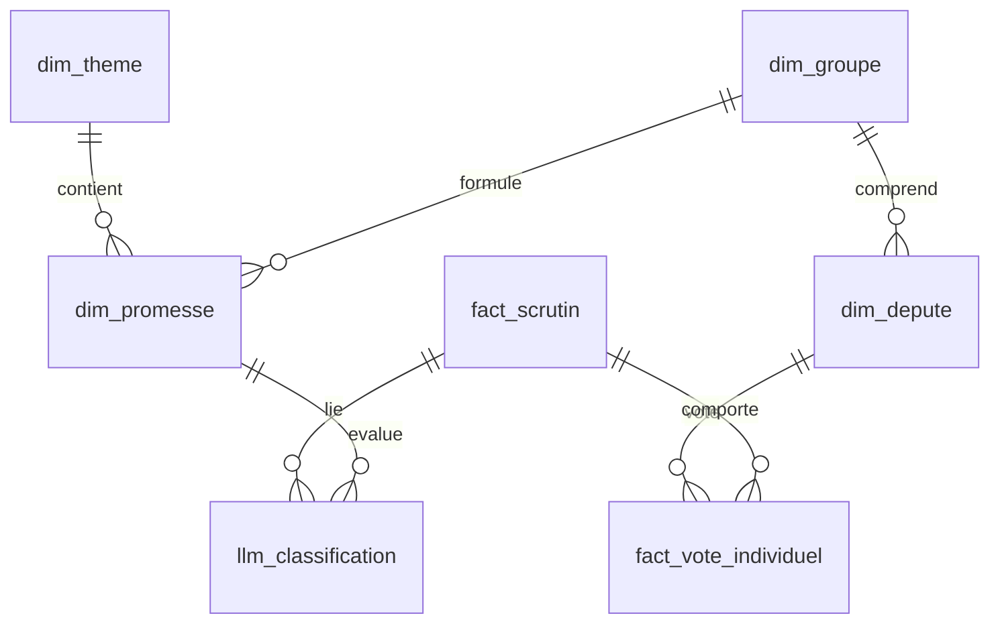

# AGENT.md — Directives & Architecture du Projet L'Éclaircie

> **À destination de tout Agent IA travaillant sur ce dépôt.**  
> Ce document définit l'architecture, les contraintes budgétaires, le schéma de données, les workflows ETL et les règles d'implémentation inviolables du projet **L'Éclaircie**.

---

## 1. Vision et Principes Fondamentaux

**L'Éclaircie** est une application Civic Tech open-source française qui mesure la cohérence entre les programmes électoraux des groupes politiques et leurs votes réels à l'Assemblée nationale pour la 17e Législature.

### ☀️ Métaphore Météorologique (Grand Public)
Le score de cohérence (0 à 100) est restitué via une métaphore intuitive :
- ☀️ **Grand Soleil** (81 - 100) : Haute cohérence / Promesses tenues
- 🌤️ **Éclaircies** (61 - 80) : Cohérence globale avec quelques nuances
- ☁️ **Nuages** (31 - 60) : Incohérences notables ou votes ambigus
- ⛈️ **Orage** (0 - 30) : Opposition marquée aux promesses engagées

### ⚖️ Principe de Neutralité Absolue & Validation Humaine
- **L'IA propose, l'humain valide** : Aucune donnée générée ou classifiée par LLM n'est visible publiquement sans validation préalable d'un administrateur (`statut_publication = 'publie'`).
- **Traçabilité totale** : Chaque note s'appuie sur une citation exacte du programme PDF et le numéro officiel du scrutin AN.

---

## 2. Stack Technique et Contraintes Strictes

| Couche | Technologie | Notes & Rôle |
|---|---|---|
| **Frontend** | Next.js 16 (App Router) + React 19 | SSR / ISR, Server Components & Server Actions |
| **Styling** | Tailwind CSS v4 + shadcn/ui | UI moderne, responsive, thématique claire/sombre |
| **Hébergement** | Vercel Hobby (Gratuit) | ISR avec `revalidate = 86400` (24h) |
| **Base de Données** | Supabase Free (Paris / PostgreSQL) | Auth + Row Level Security (RLS) + Realtime |
| **ETL & Automation** | Supabase Edge Functions + pg_cron | Execution nightly à 3h00 (anti-timeout Vercel) |
| **IA Extraction PDF** | Google Gemini 2.5 Flash | Analyse ponctuelle lourde (one-shot local) |
| **IA Classification** | Google Gemini 2.5 Flash-Lite | Traitement récurrent nightly (scrutins vs promesses) |
| **Open Data** | Assemblée nationale (ZIP JSON) | Source officielle des scrutins et des députés |

### 🚨 Directives Budgétaires et Architecturales Irrévocables
1. **Budget Stricte : < 5 € / mois** (Actuellement 0 €). Ne jamais proposer de services payants pay-per-request coûteux.
2. **Pas d'API REST custom** : Toutes les interactions de données se font directement via le client Supabase (RPC, Server Actions, RLS).
3. **Pas d'ETL lourd dans Next.js API Routes** : Les traitements longs d'ingestion/classification doivent résider exclusivement dans Supabase Edge Functions (`supabase/functions/etl-nightly`) ou dans les scripts CLI locaux.
4. **Exclusion des Non-Inscrits (NI)** : Les députés NI sont exclus des calculs de scores de groupe car ils n'ont pas de programme commun.
5. **Types strictes** : TypeScript strict partout, interdiction du type `any`.

---

## 3. Schéma de la Base de Données (Supabase)

### Tables de Dimension
- **`dim_theme`** : 10 thèmes nationaux (retraites, fiscalite, immigration, ecologie, sante, securite, education, pouvoir-achat, institutions, international).
- **`dim_groupe`** : 12 groupes politiques de la 17e Législature (RN, EPR, LFI-NFP, SOC, DR, ECOS, DEM, HOR, LIOT, GDR, UDDPLR, NI).
- **`dim_depute`** : 577 députés actifs (UID officiel AN, nom, prénom, circonscription, photo, groupe actuel).
- **`dim_depute_groupe_historique`** : Traçabilité des changements de groupe politique au cours de la mandature.
- **`dim_promesse`** : Promesses de campagne extraites des programmes PDF.
  - Champs clés : `intitule_court`, `description_longue`, `source_pdf_nom`, `source_pdf_page`, `source_citation`, `statut` ('active'|'suspendue'|'retiree').

### Tables de Faits
- **`fact_scrutin`** : Tous les votes solennels et ordinaires de l'Assemblée nationale (UID `VTANR5L17V...`, objet, exposé des motifs, sort adopté/rejeté, lien officiel).
- **`fact_vote_individuel`** : Vote exact de chaque député sur chaque scrutin (1=Pour, -1=Contre, 0=Abstention, NULL=Absent).

### Intelligence Artificielle & Caches
- **`llm_classification`** : Évaluation LLM du lien entre un scrutin et une promesse.
  - Champs clés : `polarite_llm` (1|-1), `confidence_score` (0.00-1.00), `raisonnement_llm`, `statut_validation` ('auto'|'review'|'valide'|'rejete'), `statut_publication` ('brouillon'|'publie').
- **`cache_score_groupe`** : Score calculé pré-agrégé par groupe et thème (0 à 100).
- **`cache_score_depute`** : Score individuel par député, thème, et écart vs groupe (`delta_vs_groupe`).
- **`etl_run_log`** : Logs d'exécution des jobs nocturnes avec suivi des coûts Gemini.

---

## 4. Workflows d'Ingestion & ETL

### 4.1 Scripts CLI Locaux (`scripts/`)
Exécutés ponctuellement en local avec `npx tsx` :
- `scripts/00-seed-themes.ts` : Peuple la table `dim_theme`.
- `scripts/01-fetch-deputes.ts` : Télécharge le ZIP Open Data AN, peuple `dim_groupe`, `dim_depute` et l'historique.
- `scripts/02-extract-promesses.ts` : Lit les PDF de campagne avec Gemini 2.5 Flash et extrait les promesses structurées dans `dim_promesse`.
- `scripts/03-review-promesses.ts` : Passe au cribles les promesses extraites avec Gemini 2.5 Flash-Lite pour catégoriser `auto` vs `review`.

### 4.2 Edge Function Nocturne (`supabase/functions/etl-nightly/`)
Déclenchée à 3h00 du matin via `pg_cron` :
1. Télécharge les nouveaux scrutins de l'Open Data AN.
2. Déduplique et insère les nouveautés dans `fact_scrutin` et `fact_vote_individuel`.
3. Évalue les scrutins pertinents au regard des promesses en cache avec Gemini 2.5 Flash-Lite.
4. Génère les propositions dans `llm_classification` en `statut_publication = 'brouillon'`.
5. Enregistre le rapport dans `etl_run_log`.

---

## 5. Interface Administration & Validation

L'interface `/admin` (développée sous Next.js) permet la modération humaine :
- Validation des promesses en attente de review (`/admin/promesses`).
- Validation ou rejet des classifications LLM en brouillon (`/admin/classifications`).
- Monitoring des coûts et déclenchement manuel du pipeline ETL.

---

## 6. Règles de Contribution pour l'Agent IA

- **Langue** : Commentaires de code et interfaces utilisateur en **Français**, nommage des variables, fonctions et tables DB en **Anglais**.
- **Composants UI** : Utiliser exclusivement `shadcn/ui` et Tailwind CSS.
- **Client Supabase** : Utiliser `createClient` avec la clé `service_role` uniquement dans les Server Actions / API Routes et Edge Functions. Utiliser `createBrowserClient` avec la clé `anon` côté client.
